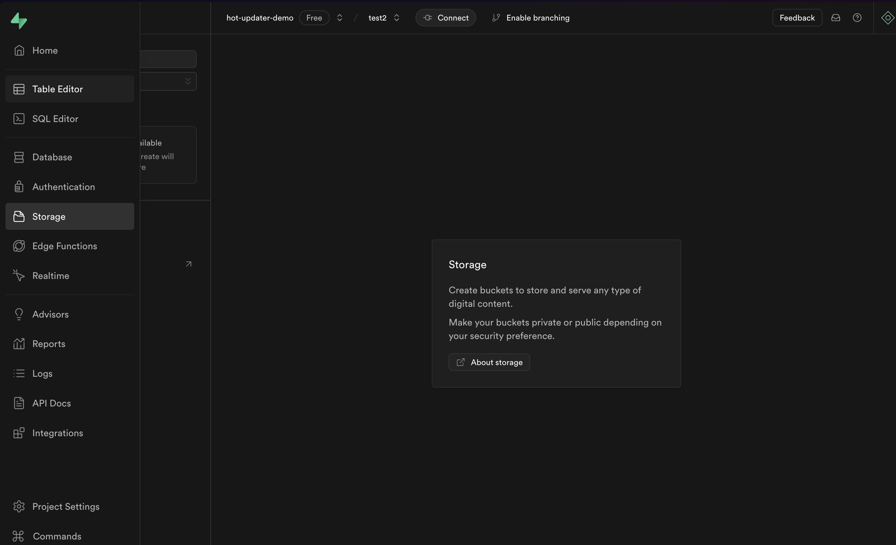

import { PackageManagerTabs } from '@theme';

# Quick Start in Supabase

## Install Supabase CLI

Please install the Supabase CLI from the link below.

https://supabase.com/docs/guides/local-development/cli/getting-started


## Create Supabase Organization

Create a Supabase Organization through the Supabase Console using the command below.

```sh
> supabase orgs create <organization-name>
```


## Create Supabase Project

Create a Supabase Project through the Supabase Console using the command below.

```sh
> supabase projects create <project-name>
```

## Setup Supabase Storage




## Install

Install in your React Native project as follows:

<PackageManagerTabs command={
  {
    npm: "npm install hot-updater @hot-updater/react-native --save-dev\nnpm run hot-updater init",
    pnpm: "pnpm add hot-updater @hot-updater/react-native -D\npnpm hot-updater init",
    yarn: "yarn add hot-updater @hot-updater/react-native -D\nyarn hot-updater init",
  }
} />


## Config
```tsx title="hot-updater.config.ts"
import { s3Storage } from "@hot-updater/aws";
import { metro } from "@hot-updater/metro";
import { postgres } from "@hot-updater/postgres";
import { config } from "dotenv";
import { defineConfig } from "hot-updater";

config({
  override: true,
});

export default defineConfig({
  console: {
    gitUrl: "https://github.com/gronxb/hot-updater",
  },
  build: metro(),
  storage: s3Storage(
    {
      // supabase s3
      forcePathStyle: true,
      endpoint: process.env.AWS_ENDPOINT!,

      // common s3
      region: process.env.AWS_REGION!,
      credentials: {
        accessKeyId: process.env.AWS_ACCESS_KEY_ID!,
        secretAccessKey: process.env.AWS_SECRET_ACCESS_KEY!,
      },
      bucketName: process.env.AWS_S3_BUCKET_NAME!,
    },
    {
      transformFileUrl: (key) => {
        return `${process.env.AWS_PUBLIC_URL!}/${key}`;
      },
    },
  ),
  database: postgres({
    host: process.env.POSTGRES_HOST!,
    port: Number(process.env.POSTGRES_PORT!),
    database: process.env.POSTGRES_DATABASE!,
    user: process.env.POSTGRES_USER!,
    password: process.env.POSTGRES_PASSWORD!,
  }),
});
```

## Usage

```tsx title="App.tsx"
import { HotUpdater } from "@hot-updater/react-native";
import { View, Text } from "react-native";

function App() {
  return (
    <View>
      <Text>Hello</Text>
    </View>
  );
}

export default HotUpdater(App)({
  source: "", // update source
  requestHeaders: {
    "Authorization": "Bearer 1234567890",
  },
  onSuccess: (status) => {
    console.log("status", status);
  },
  onError: (error) => {
    console.error(error);
  },
});

```
