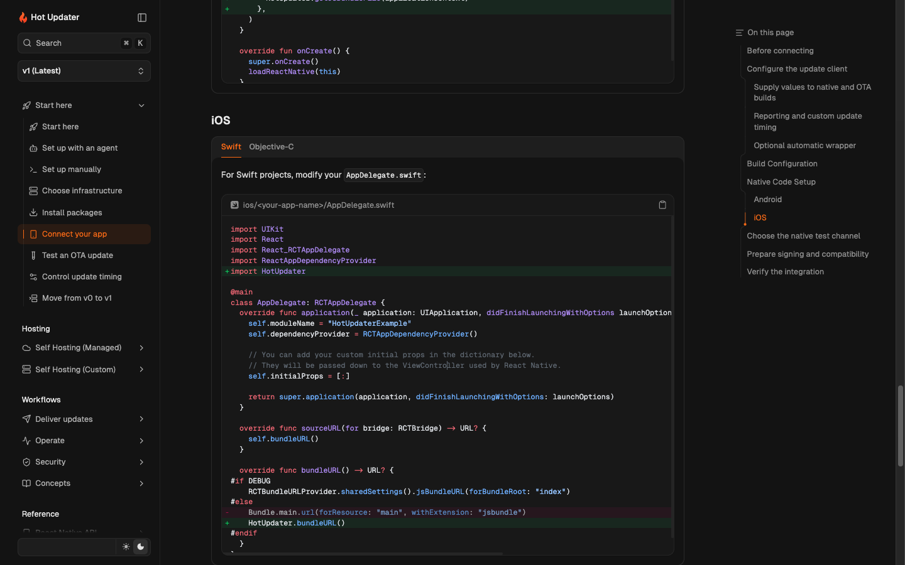

# Code snippet readability audit

All 100 latest pages and 514 fenced code blocks were read and classified, including
indented code blocks inside tabs. This follows the [Fumadocs notation guide](https://www.fumadocs.dev/docs/markdown#shiki-transformers)
and [Shiki diff/range syntax](https://shiki.style/packages/transformers#transformernotationdiff).

## Decisions

- Use green additions for imports, configuration entries and integration hooks
  that a reader adds to an existing file. Retain enough unchanged context to
  show where they belong.
- Use red removals only for real replacements: native bundle loading, a client
  option, an export, a plugin entry or an ignore pattern. Version migration
  comparisons stay in the upgrade guide.
- Leave complete new modules, API/type references, generated output and commands
  plain. File titles identify the editing target without coloring an entire example.
- Use each language's comment syntax. JSON examples with annotations use JSONC;
  XML uses XML comments. Ignore-file annotations occupy their own comment lines,
  so copied patterns keep their original meaning.
- Preserve both sides and notation in Markdown for agents. The browser's code
  copy button omits deleted lines and annotation comments, yielding applied code.

## Verification

- 120 blocks changed (annotations, file titles or equivalent diff syntax).
- All 120 annotated blocks render correctly: 618 added lines and 13 removed lines;
  exact range counts, no visible notation and all removed lines excluded from copy.
- Five renderer regression scenarios cover replacement copying, multi-line range
  boundaries and JSONC/XML/YAML comments; all ten documentation tests pass.
- Actual browser Copy Text for the native Swift example retains the new loader,
  excludes the old loader, and includes no notation or visual diff prefixes.
  The Expo app.json copy parses as valid JSON and retains the expected plugin/channel.
- The eight SDK typecheck units and seven onboarding behavior scenarios still pass.
- Production build, docs typecheck, lint, 200 latest page routes and Markdown
  serialization checks pass. Archived v0 source stays unchanged.

Independent reviewers covered hosting/database/storage, build/integrations and
workflow/security. A separate cross-review verified the app/SDK annotations,
all nine added multi-line ranges in that group, and the copy transformer.

## Page-by-page inventory

Block numbers follow source order. Numbers in Changed identify modified blocks;
all other blocks on the page were reviewed and retained. The decision column
records why the change or retention is appropriate.

| Page | Blocks reviewed | Changed | Decision |
| --- | ---: | --- | --- |
| [build-plugins/bare.mdx](../../docs/content/docs/(latest)/build-plugins/bare.mdx) | 3 | 3 | Mark the build plugin import and added build configuration within existing Hot Updater config; keep shared config context plain. |
| [build-plugins/expo.mdx](../../docs/content/docs/(latest)/build-plugins/expo.mdx) | 16 | 3, 4, 8, 9, 10, 11, 14 | Mark the build plugin import and added build configuration within existing Hot Updater config; keep shared config context plain. Expo config plugin tuple is the insertion; preserve existing per-line additions, include opening tuple, and use JSONC for valid annotation comments. Convert existing patch into syntax-highlighted TypeScript and mark the added overrideUri property; keep explanatory JSDoc plain. Convert existing patch into syntax-highlighted TSX; mark only the actual old replacement line as removal and its new lines as additions. Highlight the postinstall script added to an existing package.json; use JSONC to keep annotations syntactically valid. |
| [build-plugins/rock.mdx](../../docs/content/docs/(latest)/build-plugins/rock.mdx) | 3 | 3 | Mark the build plugin import and added build configuration within existing Hot Updater config; keep shared config context plain. |
| [concepts/automatic-rollback.mdx](../../docs/content/docs/(latest)/concepts/automatic-rollback.mdx) | 2 | — | Standalone diagnostics and lifecycle explanations stay plain. |
| [concepts/how-it-works.mdx](../../docs/content/docs/(latest)/concepts/how-it-works.mdx) | 1 | — | Standalone diagnostics and lifecycle explanations stay plain. |
| [concepts/plugin-system.mdx](../../docs/content/docs/(latest)/concepts/plugin-system.mdx) | 0 | — | Navigation/overview page without code blocks. |
| [custom/api-key-authentication.mdx](../../docs/content/docs/(latest)/custom/api-key-authentication.mdx) | 6 | 1, 2, 4 | Emphasize the explicit client access policy added to a server. Identify the custom header option without painting the existing policy. Highlight client key headers added to SDK initialization. |
| [custom/cli-configuration.mdx](../../docs/content/docs/(latest)/custom/cli-configuration.mdx) | 3 | 2 | Highlight the repository import and admin connection within the complete CLI configuration. |
| [custom/database/drizzle.mdx](../../docs/content/docs/(latest)/custom/database/drizzle.mdx) | 7 | 3, 4, 6 | Highlight generated-schema registration in the database connection. Identify the adapter import and database binding in the complete server example. Identify the generated schema file added to Drizzle Kit. |
| [custom/database/kysely.mdx](../../docs/content/docs/(latest)/custom/database/kysely.mdx) | 6 | 4 | Identify the adapter import and database binding in the complete server example. |
| [custom/database/mongodb.mdx](../../docs/content/docs/(latest)/custom/database/mongodb.mdx) | 5 | 4 | Identify the adapter import and database binding in the complete server example. |
| [custom/database/prisma.mdx](../../docs/content/docs/(latest)/custom/database/prisma.mdx) | 7 | 5 | Identify the adapter import and database binding in the complete server example. |
| [custom/database/sql-export.mdx](../../docs/content/docs/(latest)/custom/database/sql-export.mdx) | 4 | — | Keep executable commands plain. |
| [custom/frameworks/elysia.mdx](../../docs/content/docs/(latest)/custom/frameworks/elysia.mdx) | 4 | 2, 4 | Highlight framework-specific middleware and handler mounting; remove orphan annotation-only rows. Identify the CLI repository import and authenticated admin connection. |
| [custom/frameworks/express.mdx](../../docs/content/docs/(latest)/custom/frameworks/express.mdx) | 4 | 2, 4 | Highlight framework-specific middleware and handler mounting; remove orphan annotation-only rows. Identify the CLI repository import and authenticated admin connection. |
| [custom/frameworks/hono.mdx](../../docs/content/docs/(latest)/custom/frameworks/hono.mdx) | 4 | 2, 4 | Highlight framework-specific middleware and handler mounting; remove orphan annotation-only rows. Identify the CLI repository import and authenticated admin connection. |
| [custom/hosting/docker.mdx](../../docs/content/docs/(latest)/custom/hosting/docker.mdx) | 21 | 4, 5, 6, 8, 10, 12, 13, 16 | Highlight build/type settings in an existing package.json excerpt; use JSONC for comments. Highlight inclusion of the generated Hot Updater schema without coloring the whole tsconfig. Identify registration of the generated schema in the connection file. Identify the auth and Hot Updater handler wiring in the complete host entrypoint. Identify the generated schema path used by this host. Name the standalone file; no change highlighting for complete file contents. |
| [custom/hosting/vercel.mdx](../../docs/content/docs/(latest)/custom/hosting/vercel.mdx) | 12 | 5, 7, 9 | Identify registration of the generated schema in the connection file. Identify the auth and Hot Updater handler wiring in the complete host entrypoint. Identify the generated schema path used by this host. |
| [custom/overview.mdx](../../docs/content/docs/(latest)/custom/overview.mdx) | 0 | — | Navigation/overview page without code blocks. |
| [custom/quick-start.mdx](../../docs/content/docs/(latest)/custom/quick-start.mdx) | 13 | 8 | Keep the new entry file readable while emphasizing imports and handler/auth wiring; clear scattered brace-only annotations. |
| [database-plugins/aws.mdx](../../docs/content/docs/(latest)/database-plugins/aws.mdx) | 7 | 5, 7 | Highlight the provider import and database option added to the CLI config. Identify DynamoDB integration in a custom server. |
| [database-plugins/cloudflare.mdx](../../docs/content/docs/(latest)/database-plugins/cloudflare.mdx) | 5 | 3, 4 | Highlight the provider import and database option added to the CLI config. Identify the Worker runtime import and native D1 binding. |
| [database-plugins/custom-database.mdx](../../docs/content/docs/(latest)/database-plugins/custom-database.mdx) | 16 | 15, 16 | Identify the custom provider binding added to CLI configuration. Identify the matching custom provider binding in the server. |
| [database-plugins/firestore.mdx](../../docs/content/docs/(latest)/database-plugins/firestore.mdx) | 6 | 4 | Highlight the provider import and database option added to the CLI config. |
| [database-plugins/release-catalog-contract.mdx](../../docs/content/docs/(latest)/database-plugins/release-catalog-contract.mdx) | 8 | — | Keep protocol notation, output or standalone file content plain. Keep public types/interfaces plain; added-line styling would imply an API migration. Keep the current v1 protocol/type contract plain; no migration comparison. |
| [database-plugins/standalone.mdx](../../docs/content/docs/(latest)/database-plugins/standalone.mdx) | 13 | 2, 5, 6, 7 | Highlight the remote repository import/admin connection and make existing-build placeholders syntactically valid identifiers. Identify the required admin authentication headers within the repository option. Identify the alternate authentication header. Identify the custom Bundle-route mapping added to an authenticated repository. |
| [database-plugins/supabase.mdx](../../docs/content/docs/(latest)/database-plugins/supabase.mdx) | 5 | 3, 4 | Highlight the provider import and database option added to the CLI config. Identify the Edge runtime import and database connection. |
| [get-started/app-setup.mdx](../../docs/content/docs/(latest)/get-started/app-setup.mdx) | 14 | 1, 3, 4, 5, 6, 8 | Mark the module-level SDK import and configuration; leave the complete test UI neutral. Highlight the build import and build property added to an existing config. Highlight the inserted Expo config plugin; use valid JSONC comments. Mark the missing SDK import alongside the existing native loading additions. |
| [get-started/basic-usage.mdx](../../docs/content/docs/(latest)/get-started/basic-usage.mdx) | 1 | — | Installation, verification and shell commands stay plain. |
| [get-started/choose-provider.mdx](../../docs/content/docs/(latest)/get-started/choose-provider.mdx) | 0 | — | Navigation/overview page without code blocks. |
| [get-started/installation.mdx](../../docs/content/docs/(latest)/get-started/installation.mdx) | 10 | — | Installation, verification and shell commands stay plain. |
| [get-started/introduction.mdx](../../docs/content/docs/(latest)/get-started/introduction.mdx) | 0 | — | Navigation/overview page without code blocks. |
| [get-started/test-ota.mdx](../../docs/content/docs/(latest)/get-started/test-ota.mdx) | 10 | — | Installation, verification and shell commands stay plain. |
| [guides/agent-infrastructure.mdx](../../docs/content/docs/(latest)/guides/agent-infrastructure.mdx) | 7 | — | Command, command sequence or terminal example; not a source-file edit. Prompt, output, protocol shape or explanatory text; retain literal contents without diff annotations. |
| [guides/ai-agents.mdx](../../docs/content/docs/(latest)/guides/ai-agents.mdx) | 4 | — | Command, command sequence or terminal example; not a source-file edit. Prompt, output, protocol shape or explanatory text; retain literal contents without diff annotations. |
| [guides/bundle-diffing.mdx](../../docs/content/docs/(latest)/guides/bundle-diffing.mdx) | 7 | — | Prompt, output, protocol shape or explanatory text; retain literal contents without diff annotations. Command, command sequence or terminal example; not a source-file edit. Reference for enabled-by-default patch settings; adding diff markers would imply this block is required. Complete new module, standalone component/API example or configuration template; no established before/after patch to mark. |
| [guides/bundle-signing.mdx](../../docs/content/docs/(latest)/guides/bundle-signing.mdx) | 8 | 2, 5, 6, 7 | Add the native public-key path to the existing Expo plugin entry; preserve the channel as context. Add the custom native file lookup configuration to the existing CLI config. Show the two plist entries added to the existing native configuration using valid XML comments. Show metadata added inside the existing application element; XML range comments do not interrupt attributes. |
| [guides/channel-management.mdx](../../docs/content/docs/(latest)/guides/channel-management.mdx) | 14 | 2, 3, 4, 6, 14 | Correct the plist language and replace invalid JavaScript annotation comments with XML comments. Highlight the channel metadata added inside the existing Android application element. Highlight the channel option added to an existing Expo plugin entry; JSONC keeps annotation comments valid. Highlight the platform section added to an existing CLI configuration. This is a complete getter demonstration rather than a patch to a prior App component; add file context only. |
| [guides/compression.mdx](../../docs/content/docs/(latest)/guides/compression.mdx) | 2 | 1 | Highlight the compression option added to an existing CLI config. |
| [guides/console-deployment/cloudflare.mdx](../../docs/content/docs/(latest)/guides/console-deployment/cloudflare.mdx) | 10 | — | Command, command sequence or terminal example; not a source-file edit. Complete new workflow, policy, private settings file or generated data; no prior file edit is being demonstrated. |
| [guides/console-deployment/docker.mdx](../../docs/content/docs/(latest)/guides/console-deployment/docker.mdx) | 5 | — | Command, command sequence or terminal example; not a source-file edit. |
| [guides/console-deployment/index.mdx](../../docs/content/docs/(latest)/guides/console-deployment/index.mdx) | 5 | — | Command, command sequence or terminal example; not a source-file edit. Complete new module, standalone component/API example or configuration template; no established before/after patch to mark. |
| [guides/console-deployment/netlify.mdx](../../docs/content/docs/(latest)/guides/console-deployment/netlify.mdx) | 1 | — | Command, command sequence or terminal example; not a source-file edit. |
| [guides/console-deployment/vercel.mdx](../../docs/content/docs/(latest)/guides/console-deployment/vercel.mdx) | 3 | — | Command, command sequence or terminal example; not a source-file edit. |
| [guides/console.mdx](../../docs/content/docs/(latest)/guides/console.mdx) | 8 | 1, 8 | Console port is a configuration addition; use diff additions instead of generic highlighting. The repository URL is the new option, with surrounding config retained as context. |
| [guides/custom-update.mdx](../../docs/content/docs/(latest)/guides/custom-update.mdx) | 3 | 2 | This is an isolated confirmation handler for the same module, not a before/after replacement of its control flow; add the target filename only. |
| [guides/deploy.mdx](../../docs/content/docs/(latest)/guides/deploy.mdx) | 9 | — | Prompt, output, protocol shape or explanatory text; retain literal contents without diff annotations. Command, command sequence or terminal example; not a source-file edit. |
| [guides/doctor.mdx](../../docs/content/docs/(latest)/guides/doctor.mdx) | 11 | — | Command, command sequence or terminal example; not a source-file edit. Prompt, output, protocol shape or explanatory text; retain literal contents without diff annotations. |
| [guides/infrastructure-templates.mdx](../../docs/content/docs/(latest)/guides/infrastructure-templates.mdx) | 2 | — | Command, command sequence or terminal example; not a source-file edit. |
| [guides/insights.mdx](../../docs/content/docs/(latest)/guides/insights.mdx) | 2 | 1 | Add an optional app-ready observer to existing client initialization; leave client access settings as context. |
| [guides/native-build.mdx](../../docs/content/docs/(latest)/guides/native-build.mdx) | 8 | 1 | The entire nativeBuild section is added to an existing CLI config; keep its import and enclosing object unchanged. |
| [guides/rollout-cohorts.mdx](../../docs/content/docs/(latest)/guides/rollout-cohorts.mdx) | 6 | — | Command, command sequence or terminal example; not a source-file edit. Complete new module, standalone component/API example or configuration template; no established before/after patch to mark. |
| [guides/runtime-channel-switch.mdx](../../docs/content/docs/(latest)/guides/runtime-channel-switch.mdx) | 3 | 1 | Add the beta channel override to an existing check; preserve the check/download/reload lifecycle as context. |
| [guides/signing/aws-kms.mdx](../../docs/content/docs/(latest)/guides/signing/aws-kms.mdx) | 6 | 2, 4 | Replace the documented whole-directory ignore rule with selective patterns; standalone comments keep the patterns unchanged. Add the KMS signer import and signing config to the existing CLI configuration. |
| [guides/signing/google-cloud-kms.mdx](../../docs/content/docs/(latest)/guides/signing/google-cloud-kms.mdx) | 3 | 3 | Add the Google KMS signer import and signing config to the existing CLI configuration. |
| [guides/signing/local.mdx](../../docs/content/docs/(latest)/guides/signing/local.mdx) | 5 | 1, 3, 4 | Add local signing settings to the existing CLI config. Replace the documented keys/ ignore rule with private-only patterns; standalone comments keep copyable patterns correct. Append the three public-key inclusion patterns to the existing EAS ignore file, leaving its existing-rules comment as context. |
| [guides/signing/remote.mdx](../../docs/content/docs/(latest)/guides/signing/remote.mdx) | 2 | 1 | Add the remote signer import and signing config to an existing CLI configuration. |
| [guides/storage-cleanup.mdx](../../docs/content/docs/(latest)/guides/storage-cleanup.mdx) | 6 | — | Command, command sequence or terminal example; not a source-file edit. |
| [guides/update-strategies/app-version.mdx](../../docs/content/docs/(latest)/guides/update-strategies/app-version.mdx) | 4 | 1 | Mark the explicit strategy option added to the existing CLI config; do not invent a removed fingerprint setting. |
| [guides/update-strategies/fingerprint.mdx](../../docs/content/docs/(latest)/guides/update-strategies/fingerprint.mdx) | 14 | 1, 2, 3, 5, 9, 14 | Replace the explicitly configured appVersion strategy with fingerprint in the existing CLI config. Add the optional fingerprint input settings after selecting the strategy. Replace the preceding shared extraSources array with a platform-specific map. Generated fingerprint output remains unmarked; add its filename to distinguish it from a config edit. Replace appVersion with fingerprint in the existing client check so it matches the CLI strategy. Add custom native paths to the existing fingerprint CLI configuration. |
| [guides/upgrade-to-v1.mdx](../../docs/content/docs/(latest)/guides/upgrade-to-v1.mdx) | 4 | 3, 4 | Show the client-key value, required-value guard and request headers added during migration, without fabricating an old source URL. Show the actual v0 Expo plugin name replaced by the v1 plugin and the added native public-key path. |
| [integration-plugins/bugsnag.mdx](../../docs/content/docs/(latest)/integration-plugins/bugsnag.mdx) | 6 | 2, 3, 4, 5 | Highlight the monitoring wrapper import/call, required sourcemap option, and wrapper options; move explanations before annotation comments so Shiki directives terminate the line. Mark the added HotUpdater import alongside the existing codeBundleId integration option; retain existing BugSnag setup context. |
| [integration-plugins/datadog.mdx](../../docs/content/docs/(latest)/integration-plugins/datadog.mdx) | 5 | 2, 3, 4 | Highlight the monitoring wrapper import/call, required sourcemap option, and wrapper options; move explanations before annotation comments so Shiki directives terminate the line. |
| [integration-plugins/sentry.mdx](../../docs/content/docs/(latest)/integration-plugins/sentry.mdx) | 8 | 2, 4, 5, 6, 7 | Highlight the Sentry Metro import and wrapper applied to the existing Metro configuration; no invented previous export line. Mark the added Sentry plugin import as well as the existing plugin-array insertion. Highlight the monitoring wrapper import/call, required sourcemap option, and wrapper options; move explanations before annotation comments so Shiki directives terminate the line. |
| [managed/aws.mdx](../../docs/content/docs/(latest)/managed/aws.mdx) | 12 | — | Keep complete generated/provider configuration plain; no existing-file modification is being demonstrated. Keep diagnostic output plain. Keep dependency/CLI command plain; annotations would alter copied commands. Keep agent prompt plain. Keep generated provider environment output plain. Keep complete environment settings plain; these are values to supply, not a code patch. Keep executable commands plain. |
| [managed/cloudflare.mdx](../../docs/content/docs/(latest)/managed/cloudflare.mdx) | 8 | — | Keep dependency/CLI command plain; annotations would alter copied commands. Keep agent prompt plain. Keep generated provider environment output plain. Keep complete generated/provider configuration plain; no existing-file modification is being demonstrated. Keep executable commands plain. |
| [managed/firebase.mdx](../../docs/content/docs/(latest)/managed/firebase.mdx) | 8 | — | Keep dependency/CLI command plain; annotations would alter copied commands. Keep agent prompt plain. Keep generated provider environment output plain. Keep complete environment settings plain; these are values to supply, not a code patch. Keep complete generated/provider configuration plain; no existing-file modification is being demonstrated. Keep executable commands plain. |
| [managed/supabase.mdx](../../docs/content/docs/(latest)/managed/supabase.mdx) | 7 | — | Keep dependency/CLI command plain; annotations would alter copied commands. Keep agent prompt plain. Keep generated provider environment output plain. Keep complete generated/provider configuration plain; no existing-file modification is being demonstrated. Keep executable commands plain. |
| [policy/app-review.mdx](../../docs/content/docs/(latest)/policy/app-review.mdx) | 0 | — | Navigation/overview page without code blocks. |
| [policy/security.mdx](../../docs/content/docs/(latest)/policy/security.mdx) | 1 | 1 | Add the registered client header to existing app initialization, keeping provider credentials out of the app. |
| [react-native-api/addListener.mdx](../../docs/content/docs/(latest)/react-native-api/addListener.mdx) | 4 | — | Standalone usage, API signatures and return types stay plain; existing focused highlights remain. |
| [react-native-api/checkForUpdate.mdx](../../docs/content/docs/(latest)/react-native-api/checkForUpdate.mdx) | 1 | — | Standalone usage, API signatures and return types stay plain; existing focused highlights remain. |
| [react-native-api/clearCrashHistory.mdx](../../docs/content/docs/(latest)/react-native-api/clearCrashHistory.mdx) | 2 | — | Standalone usage, API signatures and return types stay plain; existing focused highlights remain. |
| [react-native-api/getActiveUpdateState.mdx](../../docs/content/docs/(latest)/react-native-api/getActiveUpdateState.mdx) | 2 | — | Standalone usage, API signatures and return types stay plain; existing focused highlights remain. |
| [react-native-api/getAppVersion.mdx](../../docs/content/docs/(latest)/react-native-api/getAppVersion.mdx) | 2 | — | Standalone usage, API signatures and return types stay plain; existing focused highlights remain. |
| [react-native-api/getBundleId.mdx](../../docs/content/docs/(latest)/react-native-api/getBundleId.mdx) | 3 | — | Standalone usage, API signatures and return types stay plain; existing focused highlights remain. |
| [react-native-api/getChannel.mdx](../../docs/content/docs/(latest)/react-native-api/getChannel.mdx) | 2 | 2 | Highlight the explicit channel option added to the standard check. |
| [react-native-api/getCohort.mdx](../../docs/content/docs/(latest)/react-native-api/getCohort.mdx) | 1 | — | Standalone usage, API signatures and return types stay plain; existing focused highlights remain. |
| [react-native-api/getCrashHistory.mdx](../../docs/content/docs/(latest)/react-native-api/getCrashHistory.mdx) | 2 | — | Standalone usage, API signatures and return types stay plain; existing focused highlights remain. |
| [react-native-api/getDefaultChannel.mdx](../../docs/content/docs/(latest)/react-native-api/getDefaultChannel.mdx) | 2 | — | Standalone usage, API signatures and return types stay plain; existing focused highlights remain. |
| [react-native-api/getInstallId.mdx](../../docs/content/docs/(latest)/react-native-api/getInstallId.mdx) | 2 | — | Standalone usage, API signatures and return types stay plain; existing focused highlights remain. |
| [react-native-api/index.mdx](../../docs/content/docs/(latest)/react-native-api/index.mdx) | 0 | — | Navigation/overview page without code blocks. |
| [react-native-api/init.mdx](../../docs/content/docs/(latest)/react-native-api/init.mdx) | 3 | 2 | Show replacing a fixed URL with runtime resolution; the copy button yields one property. |
| [react-native-api/isChannelSwitched.mdx](../../docs/content/docs/(latest)/react-native-api/isChannelSwitched.mdx) | 2 | 2 | Highlight the explicit channel option added to the standard check. |
| [react-native-api/isUpdateDownloaded.mdx](../../docs/content/docs/(latest)/react-native-api/isUpdateDownloaded.mdx) | 3 | — | Standalone usage, API signatures and return types stay plain; existing focused highlights remain. |
| [react-native-api/notifyAppReady.mdx](../../docs/content/docs/(latest)/react-native-api/notifyAppReady.mdx) | 3 | 1 | Highlight the optional result observer added to the shared client configuration. |
| [react-native-api/reload.mdx](../../docs/content/docs/(latest)/react-native-api/reload.mdx) | 1 | — | Standalone usage, API signatures and return types stay plain; existing focused highlights remain. |
| [react-native-api/resetChannel.mdx](../../docs/content/docs/(latest)/react-native-api/resetChannel.mdx) | 2 | — | Standalone usage, API signatures and return types stay plain; existing focused highlights remain. |
| [react-native-api/setCohort.mdx](../../docs/content/docs/(latest)/react-native-api/setCohort.mdx) | 2 | — | Standalone usage, API signatures and return types stay plain; existing focused highlights remain. |
| [react-native-api/setReloadBehavior.mdx](../../docs/content/docs/(latest)/react-native-api/setReloadBehavior.mdx) | 4 | — | Standalone usage, API signatures and return types stay plain; existing focused highlights remain. |
| [react-native-api/setUser.mdx](../../docs/content/docs/(latest)/react-native-api/setUser.mdx) | 2 | — | Standalone usage, API signatures and return types stay plain; existing focused highlights remain. |
| [react-native-api/updateBundle.mdx](../../docs/content/docs/(latest)/react-native-api/updateBundle.mdx) | 2 | — | Standalone usage, API signatures and return types stay plain; existing focused highlights remain. |
| [react-native-api/useHotUpdaterStore.mdx](../../docs/content/docs/(latest)/react-native-api/useHotUpdaterStore.mdx) | 3 | — | Standalone usage, API signatures and return types stay plain; existing focused highlights remain. |
| [react-native-api/wrap.mdx](../../docs/content/docs/(latest)/react-native-api/wrap.mdx) | 6 | 1, 2, 3, 4, 5, 6 | Show replacing the ordinary root export with the optional automatic wrapper. Highlight only the fallback component option being added, not unrelated client configuration. Highlight the explicit auto-reload option. Show changing the auto-reload option while copying only the selected value. Highlight lifecycle/progress callbacks added to the wrapper configuration. Replace the overlong generic highlight with an exact added error-handler range. |
| [storage-plugins/aws.mdx](../../docs/content/docs/(latest)/storage-plugins/aws.mdx) | 6 | 3, 4, 5, 6 | Highlight the storage import and configuration added to an existing Hot Updater config. Identify the R2 endpoint, region, bucket and credential settings in the S3-compatible example. Identify the optional CloudFront download URL resolver. Identify the storage array and signed download configuration added to a custom server. |
| [storage-plugins/cloudflare.mdx](../../docs/content/docs/(latest)/storage-plugins/cloudflare.mdx) | 4 | 3, 4 | Highlight the storage import and configuration added to an existing Hot Updater config. Identify Worker-specific R2 bindings and storage download signing in the complete runtime example. |
| [storage-plugins/custom-storage.mdx](../../docs/content/docs/(latest)/storage-plugins/custom-storage.mdx) | 6 | — | Keep dependency/CLI command plain; annotations would alter copied commands. Keep self-contained storage contract/helper implementation plain. Keep public types/interfaces plain; added-line styling would imply an API migration. Keep protocol notation, output or standalone file content plain. |
| [storage-plugins/firebase.mdx](../../docs/content/docs/(latest)/storage-plugins/firebase.mdx) | 4 | 4 | Highlight the storage import and configuration added to an existing Hot Updater config. |
| [storage-plugins/standalone.mdx](../../docs/content/docs/(latest)/storage-plugins/standalone.mdx) | 2 | 2 | Identify the remote-storage import, service credential and transport within the full CLI file. |
| [storage-plugins/supabase.mdx](../../docs/content/docs/(latest)/storage-plugins/supabase.mdx) | 3 | 3 | Highlight the storage import and configuration added to an existing Hot Updater config. |

