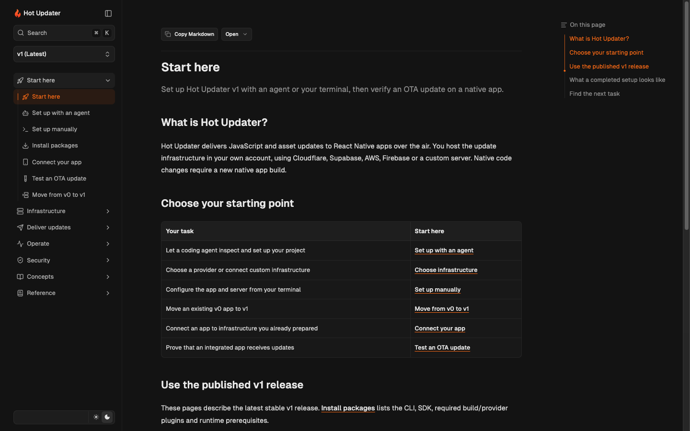

# PRD: v1 documentation for verified onboarding

Status: audit, adversarial review, implementation and local verification complete.

Baseline: `next` at `ac67b805583b423d556ea0d62650b4cd2aa5006b`.
Release context: [v1.0.0-rc.0](https://github.com/gronxb/hot-updater/releases/tag/v1.0.0-rc.0), published September 8, 2026.

## Problem

The 86 latest documentation pages mix initial setup, operational workflows,
provider details, and API references. The sidebar starts with concepts, the
619-line Basic Usage page combines several independent tasks, and the native
build guide is absent from navigation. An agent can retrieve instructions but
still needs a clear version, an ordered path, and observable completion criteria.

## Scope

Reorganize and improve v1 content in `docs/content/docs/(latest)` and the site
navigation and Markdown delivery needed to read it. Audit all 86 existing pages
and record a specific disposition for each. Preserve v0 content and historical
architecture/release records. Keep v0-to-v1 transition instructions in
`guides/upgrade-to-v1.mdx`. This is a documentation change, not a runtime change.

## Readers and jobs

| Reader | Job | Observable result |
| --- | --- | --- |
| App developer with a coding agent | Discover the app, install v1, provision infrastructure, integrate and verify delivery | Agent reports separate server, native integration and OTA results with evidence |
| App developer using the terminal | Choose a provider, configure the app and deliver a first update | A changed JavaScript marker runs in the same installed release binary |
| Existing installation owner | Find the appropriate upgrade path before changing infrastructure | Compatibility and endpoint continuity are checked before execution |
| Operator | Deploy, monitor adoption, diagnose and roll back | Finds the task without reading setup or implementation contracts |
| Integrator | Retrieve a method, adapter, plugin or server contract | Stable, focused reference with prerequisites and links to its owning workflow |

## Requirements

1. Put a clear v1 entry and agent/manual paths before concepts and references.
2. Write latest documentation for stable v1 releases, using untagged package
   installation commands. Installing a skill alone must not imply a compatible
   CLI is installed.
3. Split pages by independently executable tasks; merge duplicated workflow
   explanations into one owner. Do not split just to meet a line-count target.
4. Define setup outputs and distinguish scaffold generation, deployed-server
   checks, native integration and verified OTA delivery.
5. Make all retained pages reachable. Preserve useful public URLs and old deep
   links, or provide explicit compatibility navigation when content moves.
6. Keep provider setup, provider configuration and low-level contracts separate
   when they answer different questions. Offer a provider decision entry.
7. Keep machine-readable discovery aligned with human navigation, with correct
   canonical URLs, readable Markdown and latest-only default discovery.
8. Record competing proposals, concrete objections, accepted decisions and
   rejected ideas before treating the architecture as settled.

## Acceptance gates

- Every baseline v1 page has a reviewed inventory row and a final disposition.
- The entry page links directly to agent setup, manual setup and migration.
- Agent and manual paths converge on a release-build OTA verification procedure.
- All v1 pages appear in navigation and in the generated latest LLM index.
- Internal routes, changed anchors and generated Markdown URLs resolve.
- A cold reader can follow setup without guessing the npm channel, client key,
  update strategy, native build requirement or verification result.
- No v0 document changes; no altered runtime/protocol/resource identifiers.
- Production docs build, docs typecheck, repository lint and unit tests pass.
- PR targets `next` and includes the PRD, complete inventory, decision record,
  implementation summary and verification evidence.

## Delivery sequence

1. Inventory and independent audits; challenge each structure proposal.
2. Finalize page ownership, navigation and merge/split decisions.
3. Implement content and machine-discovery changes in disjoint file scopes.
4. Cross-review actual journeys and references, fix findings, validate and open PR.

## Delivered result and verification

The [page inventory](page-inventory.md) records all 86 baseline pages and their
accepted dispositions. Twelve extracted or missing task/reference pages bring
latest to 98 pages. Seven task groups replace the previous category-first
navigation. Existing public page URLs remain available. The
[decision record](decisions.md) includes objections, rejected merges and findings
from cross-review of the implemented journeys.

Verified on September 9, 2026:

| Gate | Result |
| --- | --- |
| Page ownership and links | All 98 latest pages appear exactly once in navigation and the LLM index; internal route, fragment and asset checks pass |
| Live production routes | All 98 HTML and 98 Markdown page URLs return successfully; canonical API index and its compatibility alias return identical Markdown |
| Markdown fidelity | All 997 fenced code blocks and 793 link destinations survive serialization across the 174 latest and archived source pages |
| Docs regressions | `pnpm --dir docs test:docs`: 2 files, 5 tests pass |
| Production build | `pnpm -w build` and final `pnpm --dir docs build` pass; no dead links |
| Static checks | `pnpm --dir docs test:type`, `pnpm -w lint` and `git diff --check` pass |
| Repository tests | `pnpm -w test`: 290 files, 2,680 tests pass |
| Executable documentation | Manual client-access probe checked against six mocked HTTP outcomes; documented database conformance command runs 48 passing tests |
| Rendered navigation | Desktop Start here and agent path inspected; version selector opens the archived v0 navigation |
| Scope | No v0 content, historical release/architecture content or runtime package changes |

The docs typecheck excludes historical `architecture/measurements` scripts,
which are standalone measurement artifacts rather than site sources. Their
contents remain unchanged. This documentation-only change does not bump a
published package.

Cloud provisioning, a device OTA run and mobile-viewport visual checks were not
performed. The first two are user-facing verification procedures described by
this change, not outcomes claimed by these local checks.

## Non-goals

No v0 rewrite, new runtime feature, provider provisioning, mobile release or
production website deployment. No general visual redesign. No duplicate manual
and agent reference trees. No claim of measured onboarding speed without a user
study; this change uses task completion checks and structural coverage instead.
